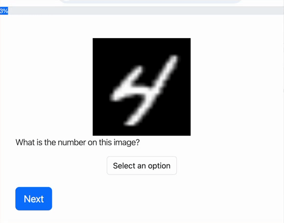
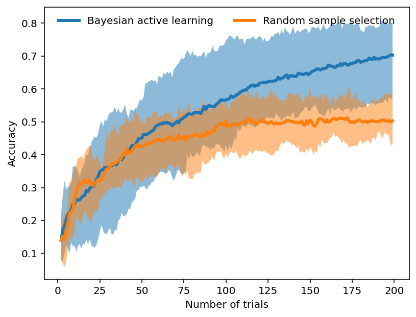

# Bayesian active learning with PsyNet

This experiment implements real-time Bayesian active learning for neural networks in PsyNet.
The example is based on the [MNIST](https://ieeexplore.ieee.org/abstract/document/6296535) image classification task.

The experiment selects optimal images to annotate using Bayesian Active Learning by Disagreement (BALD).
This strategy consists in choosing samples for which the classifier prediction is ambiguous due to model uncertainty.
The uncertainty of the model is assessed by leveraging [Dropout layers](https://arxiv.org/abs/1506.02142).

  
  

